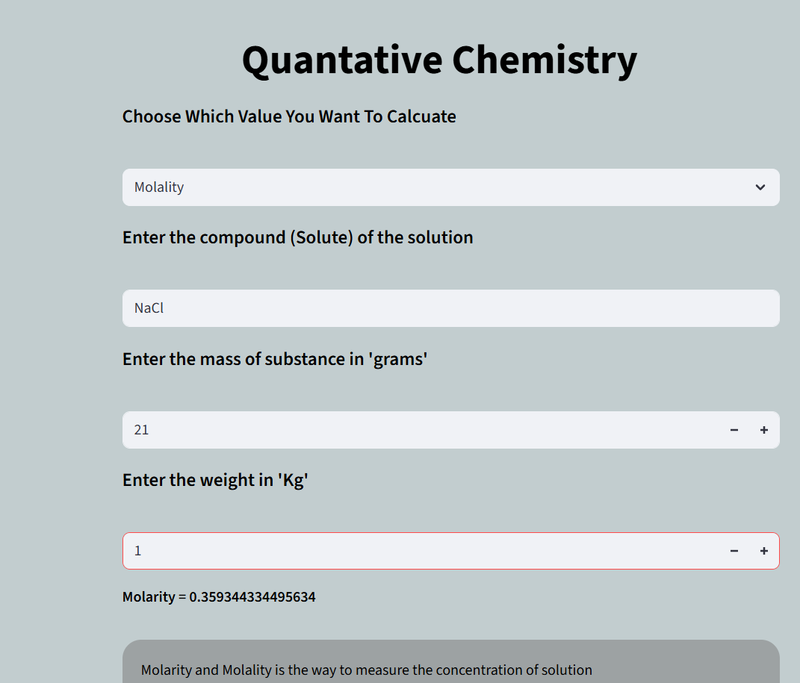
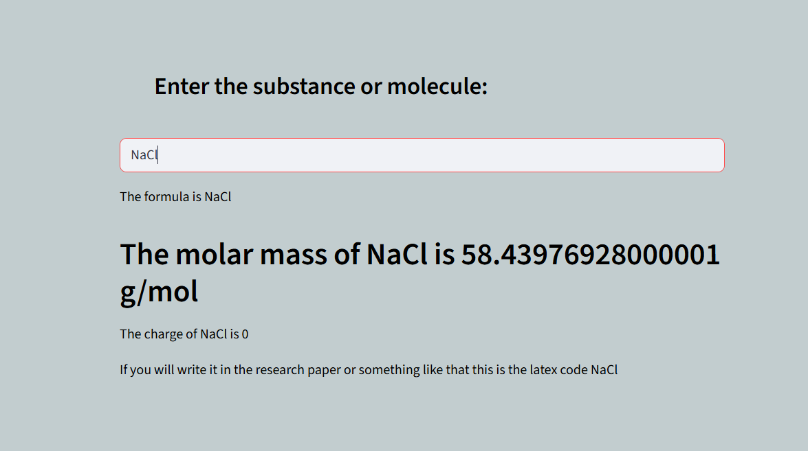
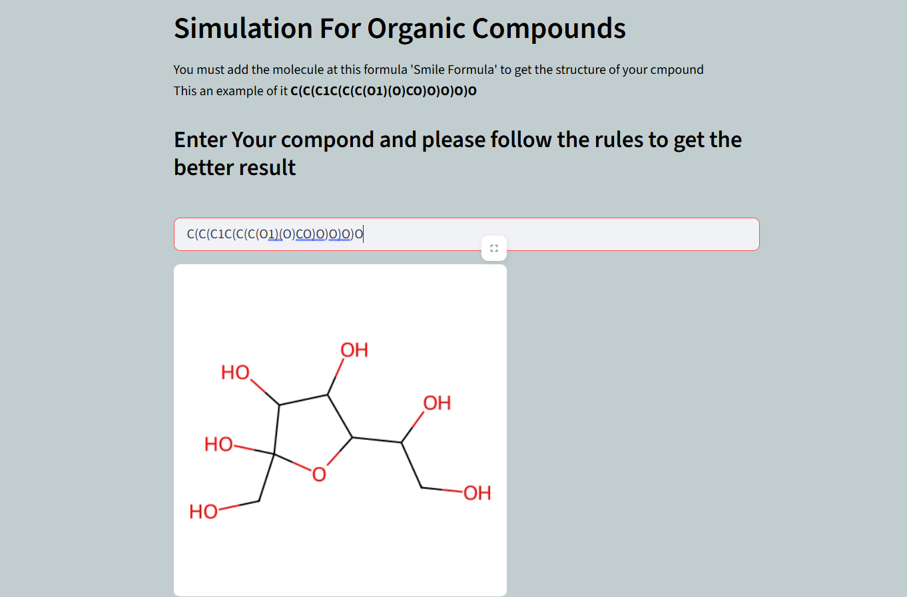
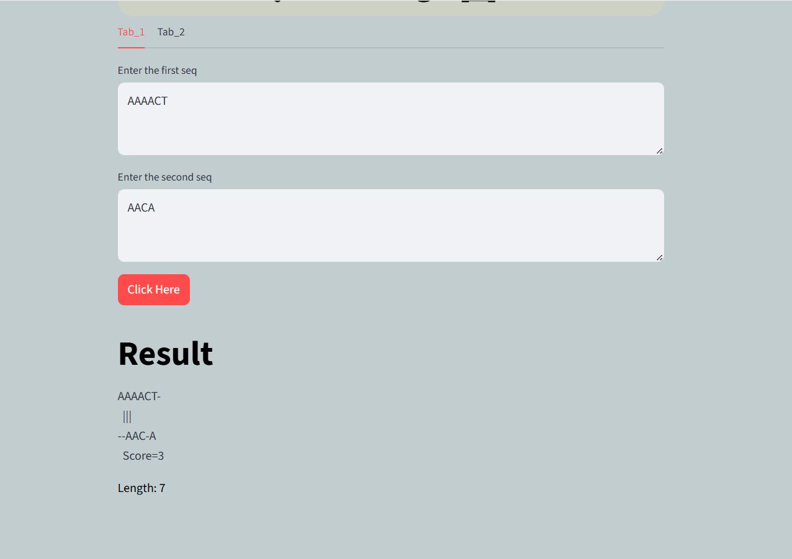
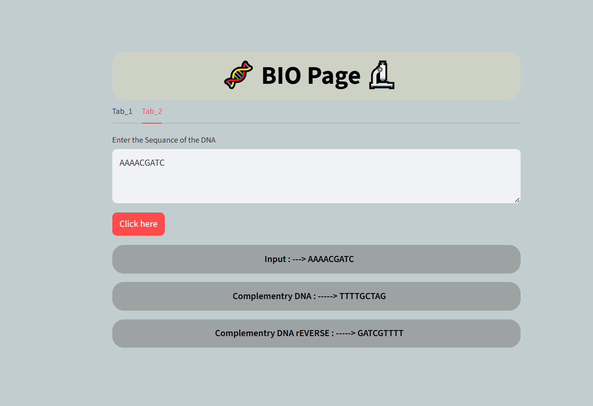
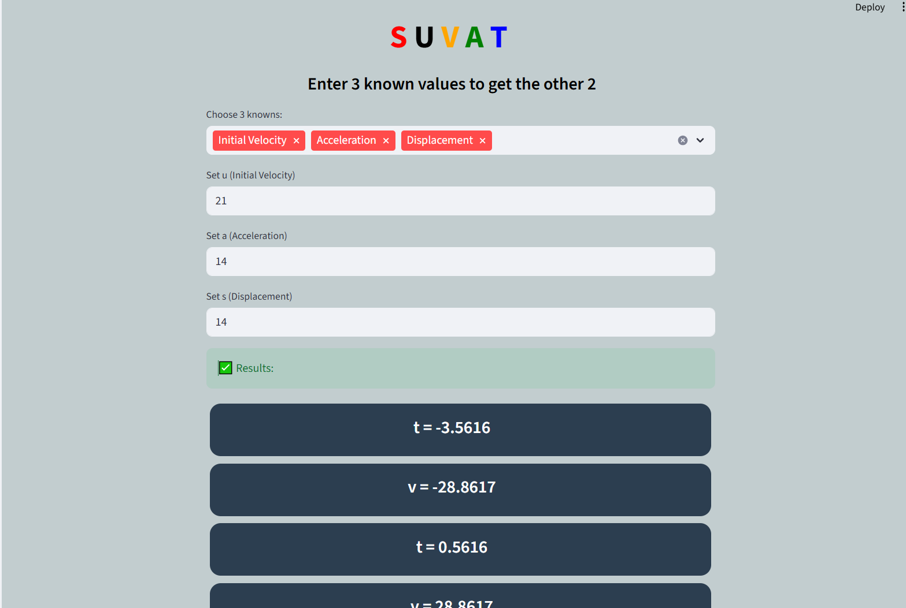
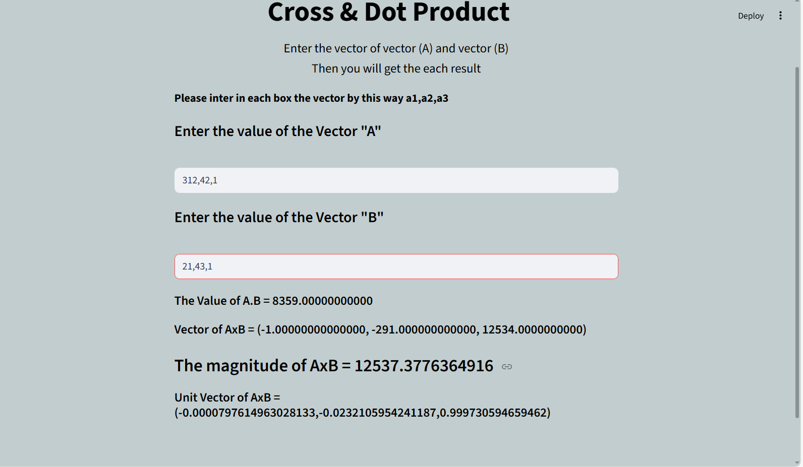
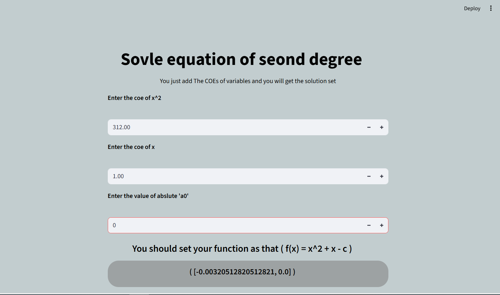

# Scientific WEB 

## This website consist of 10 pages without INTRO page

## First Page:
- Balancing ---> you can enter the reactant and the products without any coe for the compounds or element and the program will balance it

## Second Page

- Quantative ---> you can measure the molarity and molality just by tell me the molcular formula of the solute and will calcute the molar mass directly and give me the total mass of the solute then (mass or volume)

## Third Page

- You will add the compound or substance and you will get the most important info about it such as molar mass charge

# Fourth Page
- Organic compound ---> you can add any organic compound but in smile formula and you wil get the 2D image for the compound

# Fifth Page

- Projectile Motion ----> you will add info about the projectile and you will get the graph and all info you want and there is table present 25 value for the motion

# Sixth Page

- Biology ----> has 2 tabs one for the relation between 2 sequences and the the second for complementry and reverse complementry 

# Seventh Page

- SUVAT you will enter the 3 values and you will get the another two

# Eighth Page 

- Dot and Cross product here you will enter the coordinates of each vector and you will get all details about these two vectors

# Ninth Page

- you will add the coes of the equation or function and you will get (roots,zeroes)

# Tenth Page

- you will can solve equation from 1 degree in one to three variables

